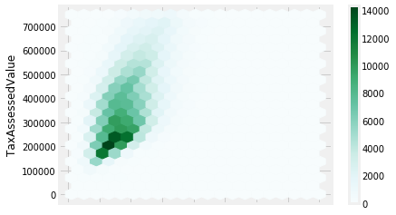

<br>

# <center> 탐색적 데이터 분석 EDA </center>

<br>


# 통계 기본
#### EDA를 위한 pandas


```python
import pandas as pd
import matplotlib.pyplot as plt
%matplotlib inline
from scipy.stats import tmean, scoreatpercentile
import seaborn as sns
import os
import numpy as np
plt.style.use('fivethirtyeight')
import warnings
warnings.filterwarnings('ignore')
```


```python
df_1 = pd.read_csv('Pre_Season_Batter.csv')
```


```python
# df_1
df_1.head(5)
```


<div>
<style scoped>
    .dataframe tbody tr th:only-of-type {
        vertical-align: middle;
    }

    .dataframe tbody tr th {
        vertical-align: top;
    }

    .dataframe thead th {
        text-align: right;
    }
</style>
<table border="1" class="dataframe">
  <thead>
    <tr style="text-align: right;">
      <th></th>
      <th>batter_id</th>
      <th>batter_name</th>
      <th>year</th>
      <th>team</th>
      <th>avg</th>
      <th>G</th>
      <th>AB</th>
      <th>R</th>
      <th>H</th>
      <th>2B</th>
      <th>...</th>
      <th>GDP</th>
      <th>SLG</th>
      <th>OBP</th>
      <th>E</th>
      <th>height/weight</th>
      <th>year_born</th>
      <th>position</th>
      <th>career</th>
      <th>starting_salary</th>
      <th>OPS</th>
    </tr>
  </thead>
  <tbody>
    <tr>
      <th>0</th>
      <td>0</td>
      <td>가르시아</td>
      <td>2018</td>
      <td>LG</td>
      <td>0.350</td>
      <td>7</td>
      <td>20</td>
      <td>1</td>
      <td>7</td>
      <td>1</td>
      <td>...</td>
      <td>1</td>
      <td>0.550</td>
      <td>0.409</td>
      <td>1</td>
      <td>177cm/93kg</td>
      <td>1985년 04월 12일</td>
      <td>내야수(우투우타)</td>
      <td>쿠바 Ciego de Avila Maximo Gomez Baez(대)</td>
      <td>NaN</td>
      <td>0.959</td>
    </tr>
    <tr>
      <th>1</th>
      <td>1</td>
      <td>강경학</td>
      <td>2011</td>
      <td>한화</td>
      <td>0.000</td>
      <td>4</td>
      <td>2</td>
      <td>2</td>
      <td>0</td>
      <td>0</td>
      <td>...</td>
      <td>0</td>
      <td>0.000</td>
      <td>0.500</td>
      <td>0</td>
      <td>180cm/72kg</td>
      <td>1992년 08월 11일</td>
      <td>내야수(우투좌타)</td>
      <td>광주대성초-광주동성중-광주동성고</td>
      <td>10000만원</td>
      <td>0.500</td>
    </tr>
    <tr>
      <th>2</th>
      <td>1</td>
      <td>강경학</td>
      <td>2014</td>
      <td>한화</td>
      <td>-</td>
      <td>4</td>
      <td>0</td>
      <td>2</td>
      <td>0</td>
      <td>0</td>
      <td>...</td>
      <td>0</td>
      <td>NaN</td>
      <td>NaN</td>
      <td>0</td>
      <td>180cm/72kg</td>
      <td>1992년 08월 11일</td>
      <td>내야수(우투좌타)</td>
      <td>광주대성초-광주동성중-광주동성고</td>
      <td>10000만원</td>
      <td>NaN</td>
    </tr>
    <tr>
      <th>3</th>
      <td>1</td>
      <td>강경학</td>
      <td>2015</td>
      <td>한화</td>
      <td>0.130</td>
      <td>10</td>
      <td>23</td>
      <td>3</td>
      <td>3</td>
      <td>0</td>
      <td>...</td>
      <td>0</td>
      <td>0.130</td>
      <td>0.286</td>
      <td>2</td>
      <td>180cm/72kg</td>
      <td>1992년 08월 11일</td>
      <td>내야수(우투좌타)</td>
      <td>광주대성초-광주동성중-광주동성고</td>
      <td>10000만원</td>
      <td>0.416</td>
    </tr>
    <tr>
      <th>4</th>
      <td>1</td>
      <td>강경학</td>
      <td>2016</td>
      <td>한화</td>
      <td>0.188</td>
      <td>14</td>
      <td>32</td>
      <td>4</td>
      <td>6</td>
      <td>1</td>
      <td>...</td>
      <td>0</td>
      <td>0.281</td>
      <td>0.212</td>
      <td>0</td>
      <td>180cm/72kg</td>
      <td>1992년 08월 11일</td>
      <td>내야수(우투좌타)</td>
      <td>광주대성초-광주동성중-광주동성고</td>
      <td>10000만원</td>
      <td>0.493</td>
    </tr>
  </tbody>
</table>
<p>5 rows × 29 columns</p>
</div>


<br>
##  데이터 명세
<br>
* batter_id  : 타자의 고유 아이디 <br>
* batter_name :  타자 이름 <br>
* year : 년도 <br>
* team : 소속팀 <br>
* avg : 타율 <br>
* G : 출전게임수 <br>
* AB : 타수(타석-볼넷-사구-희생번트-희생플라이) <br>
* R : 득점 <br>
* H : 안타(1,2,3,홈런) <br>
* 2B ,3B, HR : 2루타,3루타,홈런 <br>
* TB : 루타 수 <br>
* RBI : 타점 <br>
* SB : 도루성공 <br>
* CS : 도루실패 <br>
* BB : 볼넷 <br>
* HBP : 사구(몸에 맞는 볼) <br>
* SO : 삼진아웃 <br>
* GDP : 병살타 <br>
* SLG : 장타율 <br>
* OBP : 출루율 <br>
* E : 에러 <br>
* height/weight : 키/몸무게 <br>
* year_born : 생년월일 <br>
* position : 수비위치 <br>
* career : 선수 커리어 <br>
* starting_salary : 입단연봉 <br>
* OPS : (OBP + SLG ) <br>

<br>
## 데이터 탐색
<br>

__feature(열) ,  record(행)으로 이루어진 2차원 테이블 형태__

<br>
### 1. 위치추정
<br>

> 각 feature(변수)의 대푯값(typical value)을 구하기 <br>
> "대부분의 값이 어디에 위치하는가 <b>중심경향성</b>을 나타내는 측정지표

<br>
#### 1.1 평균(mean)과 절사평균(trimmed mean)
<br>
> "평균"은 전체값의 총합을 전체개수로 나눈 값이다. "절사평균"은 값들을 크기 순으로 정렬한 후 양끝에서 일정 개수의 값을 제거한 뒤 <br>
남은 값들을 가지고 평균을 구하는 방식이다. 따라서 "절사평균"은 극단값의 영향을 제거할 수 있는 방법이다. <br>


```python
#  일반적인 평균값 구하기
df_1['AB'].mean()
```


    19.201722900215362


```python
# 절사평균을 구하기 위한 함수만들기
# 단, 이 함수의 경우 최대,최소값들의 중복여부를 고려하지 않음
def trim_mean(arr, percent):
    lower_limit = scoreatpercentile(arr, percent)
    upper_limit = scoreatpercentile(arr, 100-percent)
    return tmean(arr, limits=(lower_limit, upper_limit), inclusive=(False, False))

my_result = trim_mean(df_1['AB'].values,10)
```


```python
my_result
```


    18.27420814479638


<br>
#### 1.2 가중평균(weighted average)
<br>
> 각 데이터값에 가중치(w)를 곱해준 후 평균을 구하는 방법 <br>
> 데이터를 크기순으로 정렬 후 가중치 부여<br>
* 어떤 값들이 본래 다른 값들에 비해 큰 변화량을 갖는다면 해당 관측값에 더 작은 가중치를 줄 수 있다.<br>
* 항상 정확히 비교가능한 관측값이 얻어지지 않으므로, 관측치가 더 적은 데이터에 가중치를주는 방법
<br>
> 평균 외에 '중간값'(=데이터를 일렬로 정렬했을때 한가운데에 위치하는 값)을 활용할 수 있다. <br>
> 중간값 또한 가중중간값을 가지며, <b>특잇값에 로버스트하다.</b>


```python
# Groupby 활용 가중평균 구하기
# df_2 = pd.DataFrame({'grp_col' : ['a', 'a', 'a', 'a', 'a', 'b', 'b', 'b', 'b', 'b'],
#                         'val' : np.arange(10)+1,'weight' : [0.0, 0.1, 0.2, 0.3, 0.4, 0.0, 0.1, 0.2, 0.3, 0.4]})

# 가중평균 함수 만들기
weighted_avg_func = lambda x : np.average(x['val'], weights=x['weight'])

grouped = df_2.groupby('grp_col')
grouped.apply(weighted_avg_func)


#  비교
# df2_avg = df_2.groupby('grp_col').mean()
# df2_avg

# 함수지정 없이 lambda만 사용
# grouped.apply(lambda x:np.average(x['val'],weights=x['weight']))
```


    grp_col
    a    4.0
    b    9.0
    dtype: float64


<br>
* **예제**
<br>
#### 인구에 따른 살인비율의 위치추정


```python
state = pd.read_csv('state.csv')
```


```python
#인구평균
state_mean = state['Population'].mean()
state_mean
```


    6162876.3


```python
#절사평균 (trimmed => 0.1)

state_trimmedAvg = trim_mean(state['Population'].values,10)
state_trimmedAvg
```


    4783697.125


```python
#중간값
state_median = state['Population'].median()
state_median
```


    4436369.5


```python
# 가중평균
grouped_state = state.groupby('State')

state_weightAvg = grouped_state.apply(lambda x : np.average(x['Murder.Rate'],weights=x['Population']))
state_weightAvg.head(5)
```


    State
    Alabama       5.7
    Alaska        5.6
    Arizona       4.7
    Arkansas      5.6
    California    4.4
    dtype: float64


<br>
## 2. 변이 추정
<br>

> 'variability' <br>
>  데이터값이 얼마나 밀집 혹은 퍼져 있는지를 나타내는 산포도(dispersion)  <br>

<br>

* **편차(deviation)**
* **분산(variance)**
* **표준편차(standard deviation)**
* **범위(range)**
* **순서통계량(order statistics)**
* **백분위수**
* **사분위수**

<br>
#### 2.1 표준편차
<br>

> 관측 데이터와 위치 추정값 사이의 차이 => '편차' <br>
> 데이터가 중앙값을 주변으로 얼마나 퍼져 있는가 <br>
> 편차의 절대값의 평균(음의 편차 고려) => 평균절대편차 <br>
> 분산(제곱편차의 평균) 표준편차(분산의 제곱근)
<br><br>

* **분산,표준편차,평균절대편차 모두 특잇값에 로버스트하지 않다**
* **분산,표준편차는 제곱 편차를 사용하기 때문에 특잇값에 민감**


```python
# Object to float
pd.to_numeric(df_1['avg'], errors='coerce')
df_1['avg_float'] = pd.to_numeric(df_1['avg'],errors='coerce')

# 전체 avg 평균 반올림하여 출력
round(df_1['avg_float'].mean(), 3)
```


    0.244


```python
# avg 표준편차
# axis = 0 => 열기준 , default
# print(df_1['avg_float'].std(axis=0))

# avg 분산
# print(df_1['avg_float'].var(axis=0))
```

    0.01973033147296696


<br>
#### 2.1 MAD
<br>

> 중위절대편차 , Median Absolute Deviation <br>
> 로버스트한 추정법 <br>
1. 표본데이터에서 중위수를 구한다 (x1,x2,x3,... => m)
2. 각 데이터에서 중위수를 뺀다( (x1-m),(x2-m),(x3-m),...)
3. 2번의 각 결과들을 절대값으로 바꾼 후 중위값을 구한다


```python
# 패키지 불러오기
# MAD
from statsmodels import robust

robust.mad(state['Population'], axis=0)

```


    3849876.1459979336


<br>
#### 2.3 백분위수 추정
<br>

> 정렬된(순위) 데이터가 얼마나 퍼져있는지를 보는것 <br>
> 순서통계량 <br>
> 가장 큰값과 작은값의 차이를 나타내는 범위에 기준 단, 범위는 특잇값에 매우 민감하기때문에 변위측정에 불리하다 <br>
<br>
> 로버스트한 순서통계량 변위추정을 위해 범위의 양끝에서 값들을 지운 후 추정 => 백분위수 <br>
> **IQR(사분위범위)** => 25번째 백분위수와 75번째 백분위수의 차이를 보는것

<br>
* **예제**
<br>
#### 주별 인구의 변위 추정


```python
# 주별 Group
grouped_state

# 표준편차 추정
print(state['Population'].std(axis=0))

# 사분위범위(IQR) 추정
## 사분위수 구하기 => .quantile()
Q1 = state['Population'].quantile(0.25)
Q3 = state['Population'].quantile(0.75)
IQR = Q3 - Q1
print(IQR)

# MAD(중위절대편차) 추정
print(robust.mad(state['Population'],axis=0))

## 표준편차과 중위절대편차의 차이가 2배가까이 난다. 즉, 표준편차는 로버스트하지 않다.
```

    6848235.347401142
    4847308.0
    3849876.1459979336


<br>
## 3. 데이터 분포
<br>

#### 3.1 백분위수 boxplot


```python
state['Population'].quantile([0.05,0.25,0.5,0.75,0.95])
```


    0.05      689529.00
    0.25     1833004.25
    0.50     4436369.50
    0.75     6680312.25
    0.95    19118545.60
    Name: Population, dtype: float64


```python
state.boxplot(column=['Population'])
plt.show()
```


<br>
#### 3.2 도수분포표 히스토그램
<br>

> 도수분포표 => 변수의 범위를 동일한 크기의 구간으로 나눈 후, 구간마다 몇개의 변수값이 존재하는가를 나타냄 <br>
> 비어있는 구간을 살펴보거나, 구간의 크기를 바꿔보며 유용한 정보를 찾아 낼 수 있음 <br>
> 도수분포표 시각화 => 히스토그램 <br>
> 히스토그램의 막대사이에 빈공간이 있다는것은 해당구간에 값이 존재하지않는다는것이며 이는 중요한 정보를 나타낼수도 있다


```python
#주별 인구 도수분포표

# 도수,구분 = np.histogram(data,도수분포구간)
# 도수 : 도수분포표의 각 구간 data 수
# 구분 : 도수분포 구간

# 구간범위 정하기
bins = int((state['Population'].max() - state['Population'].min()) /10) # (범위최대값 - 범위최소값) / 10 (10개구간으로 나누고자 할경우)

# 도수분포 구하기
hist,bins = np.histogram(state.groupby('Abbreviation')['Population'].sum(),bins)  # hist = 도수, bins = 구분
print(hist)
print(bins)

# 히스토그램 그리기
# ???
# plt.hist(state.groupby('Abbreviation')['Population'].sum(),bins)

```

    [1 0 0 ... 0 0 1]
    [  563626.   563636.   563646. ... 37253936. 37253946. 37253956.]


```python
data_url = 'http://bit.ly/2cLzoxH'  # 외부 데이터 가져오기
his_data = pd.read_csv(data_url)
his_data.head(5)
```


<div>
<style scoped>
    .dataframe tbody tr th:only-of-type {
        vertical-align: middle;
    }

    .dataframe tbody tr th {
        vertical-align: top;
    }

    .dataframe thead th {
        text-align: right;
    }
</style>
<table border="1" class="dataframe">
  <thead>
    <tr style="text-align: right;">
      <th></th>
      <th>country</th>
      <th>year</th>
      <th>pop</th>
      <th>continent</th>
      <th>lifeExp</th>
      <th>gdpPercap</th>
    </tr>
  </thead>
  <tbody>
    <tr>
      <th>0</th>
      <td>Afghanistan</td>
      <td>1952</td>
      <td>8425333.0</td>
      <td>Asia</td>
      <td>28.801</td>
      <td>779.445314</td>
    </tr>
    <tr>
      <th>1</th>
      <td>Afghanistan</td>
      <td>1957</td>
      <td>9240934.0</td>
      <td>Asia</td>
      <td>30.332</td>
      <td>820.853030</td>
    </tr>
    <tr>
      <th>2</th>
      <td>Afghanistan</td>
      <td>1962</td>
      <td>10267083.0</td>
      <td>Asia</td>
      <td>31.997</td>
      <td>853.100710</td>
    </tr>
    <tr>
      <th>3</th>
      <td>Afghanistan</td>
      <td>1967</td>
      <td>11537966.0</td>
      <td>Asia</td>
      <td>34.020</td>
      <td>836.197138</td>
    </tr>
    <tr>
      <th>4</th>
      <td>Afghanistan</td>
      <td>1972</td>
      <td>13079460.0</td>
      <td>Asia</td>
      <td>36.088</td>
      <td>739.981106</td>
    </tr>
  </tbody>
</table>
</div>


```python
his_data['lifeExp'].hist(bins=100,histtype='bar',rwidth=0.9)
plt.xlabel('lifeExp'),plt.ylabel('frequency')
```


    (Text(0.5,0,'lifeExp'), Text(0,0.5,'frequency'))


<br>
#### 3.3 이진 데이터와 범주형 데이터
<br>

> 범주형 데이터에서는 비율,퍼센트를 활용한다 <br>

* 최빈값
<br>
* **기댓값** <br>
 => 어떠한 목적(상업적)을 위해 하나의 '기댓값'을 도출해 낼 수 있다 <br>
 => 기댓값은 가중평균과 같은 꼴이다 <br>
 => 어떤값과 그 값이 일어날 확률을 서로 곱해 더한 값을 의미한다 : EV=(0.05)(300) +(0.15)(50)+(0.8)(0) = 22.5


```python
## 범주형 데이터로 변환
# df_1['position'].astype('category')

## 카테고리별 갯수를 counting 해준 뒤 시각화
df_1.groupby('position')['position'].count().plot(kind='bar')
```


    <matplotlib.axes._subplots.AxesSubplot at 0x2aca573f320>


```python
df_1.groupby('position')['position'].count().plot(kind='pie')
```


    <matplotlib.axes._subplots.AxesSubplot at 0x2aca5895b70>


<br>
#### 3.4 상관계수
<br>

> 예측값과 목표값과의 상관계수 <br>
> 변수간의 한 변수의 변화에 따른 변수의 변화 정도와 방향을 예측하는 분석기법 <br>
> <b> 변수간의 인과관계를 나타내는 것이 아니며 변수간의 관련성을 파악하기 위한 용도로 사용 </b> <br>
> 상관계수는 -1 ~ 1 사이의 값을 가지며, 연속형데이터에 대해서 적용한다


```python
## 연속형 변수 추출
state_cor = state[['Population','Murder.Rate']]

## 인구수와 살인비율의 상관계수
state_cor.corr()
```


<div>
<style scoped>
    .dataframe tbody tr th:only-of-type {
        vertical-align: middle;
    }

    .dataframe tbody tr th {
        vertical-align: top;
    }

    .dataframe thead th {
        text-align: right;
    }
</style>
<table border="1" class="dataframe">
  <thead>
    <tr style="text-align: right;">
      <th></th>
      <th>Population</th>
      <th>Murder.Rate</th>
    </tr>
  </thead>
  <tbody>
    <tr>
      <th>Population</th>
      <td>1.000000</td>
      <td>0.182069</td>
    </tr>
    <tr>
      <th>Murder.Rate</th>
      <td>0.182069</td>
      <td>1.000000</td>
    </tr>
  </tbody>
</table>
</div>


```python
## 방법2
state['Population'].corr(state['Murder.Rate'])
```


    0.1820693429486802


```python
## 야구 데이터 상관계수 분석
df_1_corr = df_1[['year','G','AB','R','H','2B','3B','HR','TB','RBI','SB','CS','BB','HBP','SO','GDP']]

## 상관계수 행렬
df_1_matrix = df_1_corr.corr().head(5)
df_1_matrix.head(5)
```


<div>
<style scoped>
    .dataframe tbody tr th:only-of-type {
        vertical-align: middle;
    }

    .dataframe tbody tr th {
        vertical-align: top;
    }

    .dataframe thead th {
        text-align: right;
    }
</style>
<table border="1" class="dataframe">
  <thead>
    <tr style="text-align: right;">
      <th></th>
      <th>year</th>
      <th>G</th>
      <th>AB</th>
      <th>R</th>
      <th>H</th>
      <th>2B</th>
      <th>3B</th>
      <th>HR</th>
      <th>TB</th>
      <th>RBI</th>
      <th>SB</th>
      <th>CS</th>
      <th>BB</th>
      <th>HBP</th>
      <th>SO</th>
      <th>GDP</th>
    </tr>
  </thead>
  <tbody>
    <tr>
      <th>year</th>
      <td>1.000000</td>
      <td>-0.052724</td>
      <td>-0.124997</td>
      <td>-0.037957</td>
      <td>-0.061322</td>
      <td>-0.071173</td>
      <td>0.033396</td>
      <td>-0.030596</td>
      <td>-0.059349</td>
      <td>-0.038890</td>
      <td>-0.094197</td>
      <td>-0.021085</td>
      <td>-0.055295</td>
      <td>-0.046607</td>
      <td>-0.096983</td>
      <td>-0.066485</td>
    </tr>
    <tr>
      <th>G</th>
      <td>-0.052724</td>
      <td>1.000000</td>
      <td>0.740827</td>
      <td>0.681357</td>
      <td>0.637177</td>
      <td>0.380824</td>
      <td>0.256658</td>
      <td>0.209911</td>
      <td>0.584077</td>
      <td>0.460391</td>
      <td>0.333558</td>
      <td>0.223256</td>
      <td>0.419496</td>
      <td>0.201577</td>
      <td>0.599578</td>
      <td>0.258046</td>
    </tr>
    <tr>
      <th>AB</th>
      <td>-0.124997</td>
      <td>0.740827</td>
      <td>1.000000</td>
      <td>0.747165</td>
      <td>0.890546</td>
      <td>0.589264</td>
      <td>0.286405</td>
      <td>0.374816</td>
      <td>0.846330</td>
      <td>0.664648</td>
      <td>0.362959</td>
      <td>0.240986</td>
      <td>0.569244</td>
      <td>0.216046</td>
      <td>0.735374</td>
      <td>0.386200</td>
    </tr>
    <tr>
      <th>R</th>
      <td>-0.037957</td>
      <td>0.681357</td>
      <td>0.747165</td>
      <td>1.000000</td>
      <td>0.783290</td>
      <td>0.513408</td>
      <td>0.282079</td>
      <td>0.451541</td>
      <td>0.788865</td>
      <td>0.608705</td>
      <td>0.443408</td>
      <td>0.224133</td>
      <td>0.534037</td>
      <td>0.214750</td>
      <td>0.523556</td>
      <td>0.229514</td>
    </tr>
    <tr>
      <th>H</th>
      <td>-0.061322</td>
      <td>0.637177</td>
      <td>0.890546</td>
      <td>0.783290</td>
      <td>1.000000</td>
      <td>0.660301</td>
      <td>0.285611</td>
      <td>0.417939</td>
      <td>0.944901</td>
      <td>0.719841</td>
      <td>0.358165</td>
      <td>0.234635</td>
      <td>0.509061</td>
      <td>0.184500</td>
      <td>0.559126</td>
      <td>0.329099</td>
    </tr>
  </tbody>
</table>
</div>


```python
## 하나의 변수와 나머지 변수와의 상관관계 분석
df_1.corrwith(df_1['OPS'])
```


    batter_id   -0.067036
    year         0.051496
    G            0.058661
    AB           0.148324
    R            0.301075
    H            0.397155
    2B           0.307295
    3B           0.117101
    HR           0.394804
    TB           0.464214
    RBI          0.378170
    SB           0.063304
    CS           0.042884
    BB           0.201346
    HBP          0.079176
    SO           0.015086
    GDP          0.042631
    SLG          0.961944
    OBP          0.865307
    E            0.014341
    OPS          1.000000
    dtype: float64


```python
from pandas.plotting import scatter_matrix

## 산점도 전체 보기
# attributes = ["OPS", "HBP", "SLG", "OBP"]
# scatter_matrix(df_1[attributes], figsize=(12, 8))

## 특정 산점도 확대
df_1.plot(kind="scatter", x="HBP", y="TB", alpha=0.1)
```


    <matplotlib.axes._subplots.AxesSubplot at 0x1a41961eda0>


```python
# scatterplot matrix with histogram only for continuous variables
# seaborn 활용 산점도
sns.pairplot(state, diag_kind='hist')  # 대각선 그림은 히스토그램으로

plt.show()
```


<br>
## 4. 두 개 이상의 변수 탐색
<br>

>일변량 분석 : 평균,분산 <br>
>이변량 분석 : 상관분석 <br>
>다변량 분석

## <br>
#### 4.1 육각형 구간과 등고선
<br>

> 수치형 변수 대 수치형 변수를 시각화 <br>
> 산점도의 경우 레코드가 수십,수백만에 이를 경우 데이터가 너무 밀집되어 알아보기 어렵다


```python
kc_tax = pd.read_csv("kc_tax.csv")


# ## 특잇값 제거
kc_tax['TaxAssessedValue'] = kc_tax[kc_tax.TaxAssessedValue < 750000]
kc_tax['SqFtTotLiving']=kc_tax['SqFtTotLiving'][kc_tax['SqFtTotLiving'] >100]  ## 이 코드로 해야함. 아래코드랑 무슨차이????
# kc_tax['SqFtTotLiving'] = kc_tax[(kc_tax.SqFtTotLiving > 100) & (kc_tax.SqFtTotLiving<3500)]

kc_tax_hexbin = kc_tax[['TaxAssessedValue','SqFtTotLiving']]
kc_tax_hexbin.corr()
```


<div>
<style scoped>
    .dataframe tbody tr th:only-of-type {
        vertical-align: middle;
    }

    .dataframe tbody tr th {
        vertical-align: top;
    }

    .dataframe thead th {
        text-align: right;
    }
</style>
<table border="1" class="dataframe">
  <thead>
    <tr style="text-align: right;">
      <th></th>
      <th>TaxAssessedValue</th>
      <th>SqFtTotLiving</th>
    </tr>
  </thead>
  <tbody>
    <tr>
      <th>TaxAssessedValue</th>
      <td>1.000000</td>
      <td>0.541982</td>
    </tr>
    <tr>
      <th>SqFtTotLiving</th>
      <td>0.541982</td>
      <td>1.000000</td>
    </tr>
  </tbody>
</table>
</div>


```python
ax = kc_tax_hexbin.plot.hexbin(x='SqFtTotLiving', y='TaxAssessedValue', gridsize=20)
```





<br>
#### 4.2 분할표
<br>

> 범주형데이터 대 범주형데이터 비교 <br>
> 교차표(cross table) 이용


```python
lc_loans = pd.read_csv('lc_loans.csv')

## ['grade'] 값을 조건에 맞게 category형으로 치환
def grade_category(lc_loans) :
    if  lc_loans['grade'] >= 7 :
        return 'A'
    elif lc_loans['grade'] >= 6 :
        return 'B'
    elif lc_loans['grade'] >= 5 :
        return 'C'
    elif lc_loans['grade'] >= 4 :
        return 'D'
    elif lc_loans['grade'] >= 3 :
        return 'E'
    elif lc_loans['grade'] >= 2 :
        return 'F'
    else :
        return 'G'

```


```python
## 함수적용
lc_loans['grade'] = lc_loans.apply(grade_category, axis=1)
```


```python
## grade 기준 crosstab 생성
loans_crosstab = pd.crosstab(lc_loans.grade,lc_loans.status, margins=True)
```


```python
loans_crosstab
```


<div>
<style scoped>
    .dataframe tbody tr th:only-of-type {
        vertical-align: middle;
    }

    .dataframe tbody tr th {
        vertical-align: top;
    }

    .dataframe thead th {
        text-align: right;
    }
</style>
<table border="1" class="dataframe">
  <thead>
    <tr style="text-align: right;">
      <th>status</th>
      <th>Charged Off</th>
      <th>Current</th>
      <th>Fully Paid</th>
      <th>Late</th>
      <th>All</th>
    </tr>
    <tr>
      <th>grade</th>
      <th></th>
      <th></th>
      <th></th>
      <th></th>
      <th></th>
    </tr>
  </thead>
  <tbody>
    <tr>
      <th>A</th>
      <td>549</td>
      <td>14864</td>
      <td>5362</td>
      <td>184</td>
      <td>20959</td>
    </tr>
    <tr>
      <th>B</th>
      <td>2178</td>
      <td>52311</td>
      <td>20647</td>
      <td>741</td>
      <td>75877</td>
    </tr>
    <tr>
      <th>C</th>
      <td>5263</td>
      <td>92603</td>
      <td>29376</td>
      <td>2171</td>
      <td>129413</td>
    </tr>
    <tr>
      <th>D</th>
      <td>5720</td>
      <td>80967</td>
      <td>21390</td>
      <td>2619</td>
      <td>110696</td>
    </tr>
    <tr>
      <th>E</th>
      <td>4651</td>
      <td>48730</td>
      <td>12478</td>
      <td>2162</td>
      <td>68021</td>
    </tr>
    <tr>
      <th>F</th>
      <td>2599</td>
      <td>22190</td>
      <td>5363</td>
      <td>1187</td>
      <td>31339</td>
    </tr>
    <tr>
      <th>G</th>
      <td>1711</td>
      <td>9520</td>
      <td>2700</td>
      <td>725</td>
      <td>14656</td>
    </tr>
    <tr>
      <th>All</th>
      <td>22671</td>
      <td>321185</td>
      <td>97316</td>
      <td>9789</td>
      <td>450961</td>
    </tr>
  </tbody>
</table>
</div>


```python
## 빈도수 시각화 1.
loans_crosstab.loc['A',].plot(kind='bar')
```


    <matplotlib.axes._subplots.AxesSubplot at 0x2b3bafb5e80>


```python
## 빈도수 시각화 2. (내림차순)
loans_crosstab2=loans_crosstab.loc['A',].sort_values().plot(kind='barh',title='A')
```


<br>
#### 4.3 범주형 변수 대 수치형 변수
<br>

> 범주형 변수에 따라 분리 된 수치형 변수의 분포를 살펴본다 <br>
> boxplot , 바이올린 도표 활용 <br>


```python
airline_delay = pd.read_csv('airline_stats.csv')
```

### boxplot 실행 시 AttributeError: 'Series' object has no attribute 'boxplot' 에러가 뜨는 경우
<br>


```python
## 항공기 사고에 따른 비행사별 항공 지연 비율
## airline_delay['pct_atc_delay'].boxplot(by='airline')의 경우 series 에러 발생한다
airline_delay.boxplot(column='pct_atc_delay' , by='airline')
plt.title("각 Feature 값들의 빈도수에 대한 Box Plot")
plt.xlabel("Feature")
plt.ylabel("데이터 값")
plt.show()
```


<br>
#### 4.4 다변수 시각화
<br>

> '조건화' 활용 <br>


```python
kc_tax_selected.groupby('ZipCode').size()
```


    ZipCode
    98105.0    6501
    98108.0    5606
    98126.0    5822
    98188.0    4109
    dtype: int64


```python
kc_tax['ZipCode'].astype('category')

## 특정 우편번호 추출
## and or 연산자 사용할 시 &,| 으로 할것
kc_tax_selected = kc_tax[(kc_tax.ZipCode== 98105) | (kc_tax.ZipCode == 98108) | (kc_tax.ZipCode == 98126) | (kc_tax.ZipCode == 98188)]

selected_hexbin = kc_tax_selected.groupby('ZipCode').plot.hexbin(x='SqFtTotLiving', y='TaxAssessedValue', gridsize=20)

## 특정 우편번호에 따른 평가액 비교 도식화
## 왜 5개?... 도표별 라벨 달기

```


